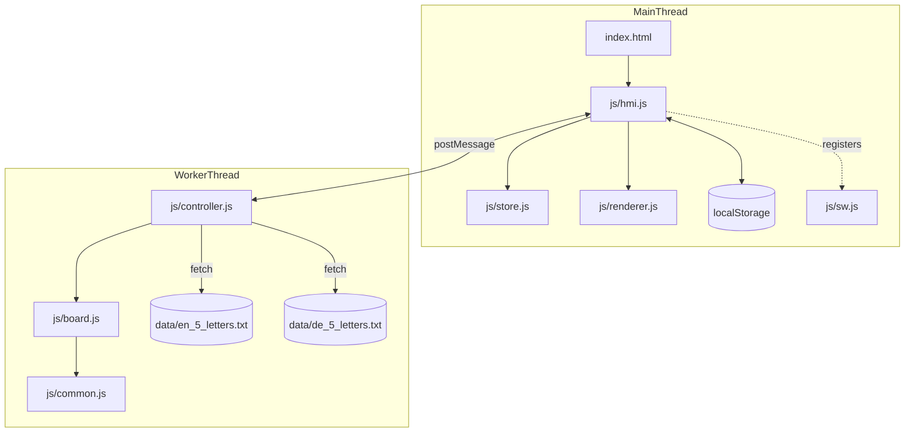
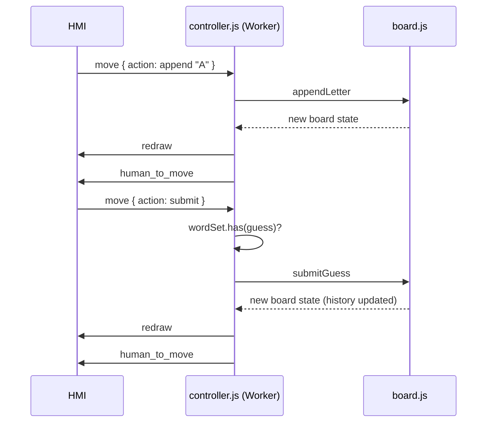
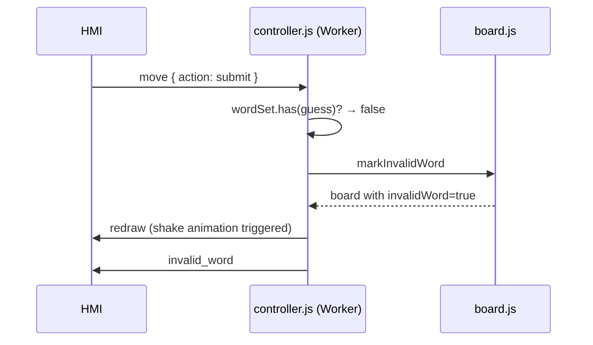
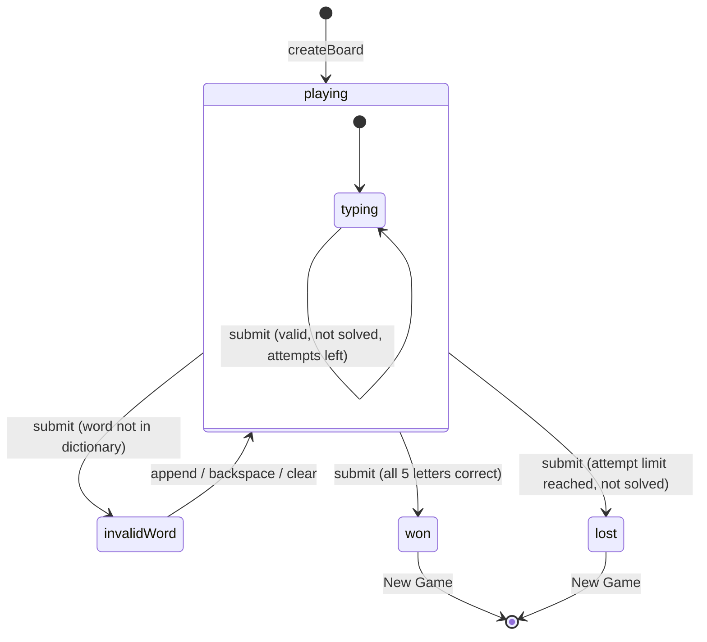
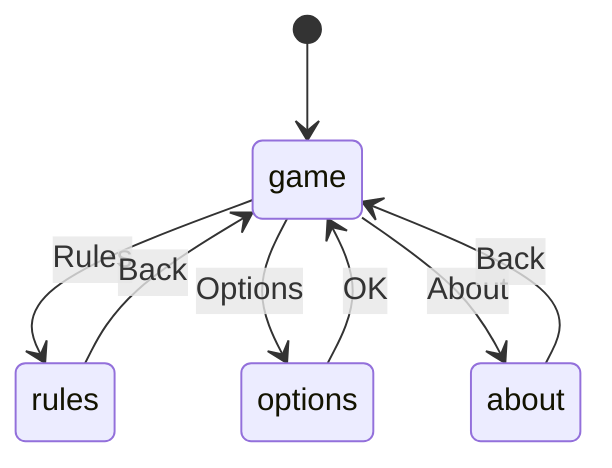
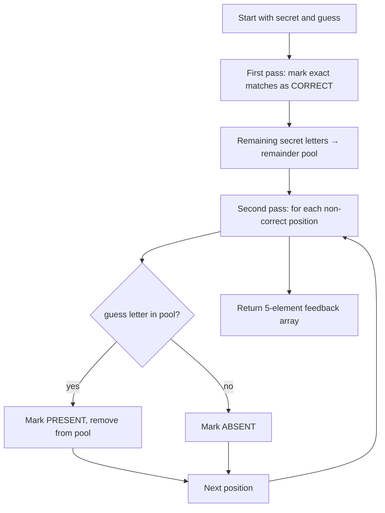

# Software Architecture – Word Code Breaker

## 1. System Overview

Word Code Breaker is a browser-based single-page word guessing game organised into four layers:

- **Pure rules core**: `js/board.js`, `js/common.js`
- **Worker orchestration**: `js/controller.js`
- **UI state and persistence**: `js/store.js`, `js/hmi.js`
- **View rendering and shell**: `js/renderer.js`, `index.html`, `css/index.css`

Key architectural goals:

- Deterministic, testable rules with immutable state transitions
- Language-aware keyboard (EN: QWERTY A–Z; DE: QWERTZ A–Z + Ä, Ö, Ü)
- Isolated side effects (DOM, localStorage, timers, worker messaging)
- Offline support via service worker and cached word lists

---

## 2. Functional Requirements

### 2.1 Gameplay

- The player guesses a hidden 5-letter word chosen from a language-specific dictionary.
- Each guess must be a valid word in the dictionary (validated by the worker).
- Per-letter feedback scoring algorithm:
  - **Correct** (green): right letter, right position
  - **Present** (yellow): right letter, wrong position
  - **Absent** (grey): letter not in the word
- **Direct feedback** (selectable): tiles are coloured with the above scheme.
- **Indirect feedback** (selectable): the row also shows a count of correct + present letters.
- **Feedback mode**: one of `direct`, `indirect`, or `both` (default), selected via radio button in options.

### 2.2 Options

- Language: English or German
- Attempt cap: 6, 8, 10, or unlimited
- **Feedback mode**: Direct, Indirect, or Both (default: Both)

### 2.3 Result States

- **Won**: celebration overlay animation, highscore recorded
- **Lost**: secret revealed, tilt animation on last row

### 2.4 Persistence

- Highscores keyed by language + max-attempts; stored per day, week, month
- Settings persist locally between sessions

### 2.5 Shell Behaviour

- Main navigation: New Game, Rules, Options, About
- Physical keyboard: letter keys, Backspace, Enter
- On-screen keyboard: language-appropriate rows with letter-state colouring

---

## 3. Domain Model

### 3.1 Board State (`board.js`)

| Field | Description |
| --- | --- |
| `settings` | `{ language, maxAttempts, directFeedback, indirectFeedback }` — derived from `feedbackMode` radio selection |
| `secret` | Array of 5 uppercase letters |
| `currentGuess` | Letters typed so far |
| `history` | `[{ guess, feedback[], indirectScore }]` |
| `letterStates` | Map of letter → best feedback (drives keyboard colours) |
| `status` | `playing` / `won` / `lost` |
| `invalidWord` | `true` while showing the shake animation |
| `keyboardRows` | Language-specific keyboard rows |
| Derived | `canSubmit`, `attemptsUsed`, `attemptsRemaining`, `message` |

### 3.2 Letter Feedback Constants

```text
CORRECT  → green  (right letter, right position)
PRESENT  → yellow (right letter, wrong position)
ABSENT   → grey   (not in word)
```

### 3.3 Input Actions

| Action | Payload |
| --- | --- |
| `append` | `{ letter: "A" }` |
| `backspace` | — |
| `clear` | — |
| `submit` | — |

---

## 4. Architecture Block Diagram



---

## 5. Message Flow

### 5.1 Worker Protocol

**HMI → Controller** (requests):

| Request | When |
| --- | --- |
| `start` | App initialisation |
| `restart` | New Game or options confirmed |
| `move` | Player action (append/backspace/submit/clear) |
| `sync` | Force re-render |

**Controller → HMI** (responses):

| Response | Payload | When |
| --- | --- | --- |
| `redraw` | board snapshot | Every state change |
| `human_to_move` | board snapshot | Player's turn ready |
| `invalid_word` | board snapshot (invalidWord=true) | Submitted word not in dictionary |

### 5.2 Message Sequence – Valid Guess



### 5.3 Message Sequence – Invalid Word



---

## 6. State Chart – Game Board



---

## 7. State Chart – Application Navigation



---

## 8. Keyboard Layout

### English (QWERTY)

```text
Q W E R T Y U I O P
 A S D F G H J K L
ENTER Z X C V B N M BACK
```

### German (QWERTZ + Ä Ö Ü)

```text
Q W E R T Z U I O P Ü
 A S D F G H J K L Ö Ä
ENTER Y X C V B N M BACK
```

Key colour states: `unused` → `absent` (grey) → `present` (yellow) → `correct` (green)

---

## 9. Scoring Algorithm



---

## 10. Testing Strategy

- **Unit tests** cover `board.js` (scoreWordGuess, applyAction, history, highscore), `common.js` (keyboard layouts, normalizeSettings), `store.js`, and `controller.js` (word list mocking, invalid word flow).
- **Playwright E2E tests** cover shell load, navigation, settings update (language/attempts), guess submission via on-screen keyboard, and highscore reset flows.
- Vitest coverage thresholds: **98 %** for statements, branches, functions, and lines.

---

## 11. PWA Packaging

- `manifest.json`, `manifest.webapp`, and `manifest_hosted.webapp` reflect Word Code Breaker branding.
- `config.xml` contains the Cordova package `io.github.omerkel.wordcodebreaker`.
- `js/sw.js` caches the app shell, `data/en_5_letters.txt`, and `data/de_5_letters.txt` for offline startup.
- Cache name: `word-code-breaker-v1`.
